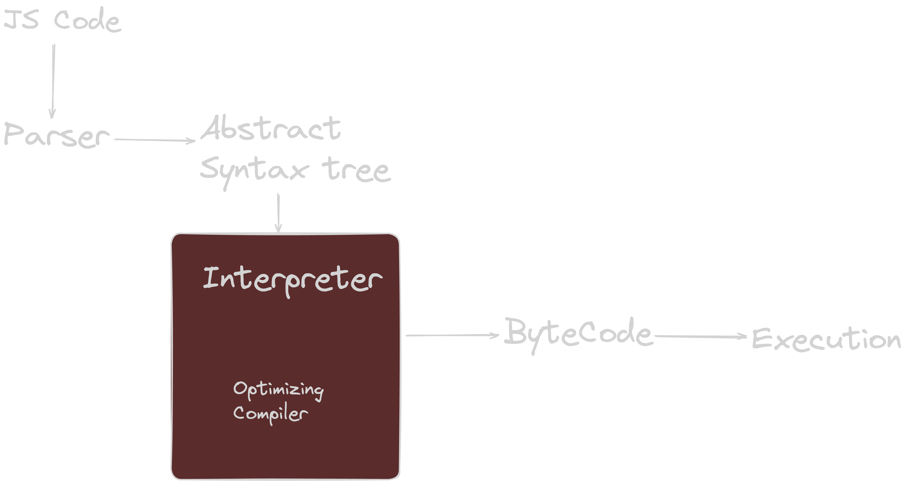

# Javascript Questions - Set 1

1. Is javascript single threaded or multi-threaded?

  
Click to expand!

JavaScript is a single-threaded language. This means it has one call stack and one memory heap. As expected, it executes code in order and must finish executing a piece code before moving onto the next. This is what allows JavaScript to be non-blocking and use async operations. 
However, Javascript also has asynchronous behavior. This is what allows us to use setTimeout, AJAX, and promises. These functions are handled by the browser, not by JavaScript itself. This is what allows JavaScript to be non-blocking for main thread operations.

2. Explain how javascript engines works?

  
Click to expand!

JavaScript engines are programs that execute JavaScript code. They are found in web browsers and other environments that host JavaScript. The most popular JavaScript engines are Google's V8, SpiderMonkey, and JavaScriptCore. These engines are written in C++ and are used to execute JavaScript code.

3. What is event loop in javascript?
  

  
Click to expand!

  Check out the 2nd video in JS Pro Interview section. Make sure that you ask interviewer to allow you to draw the diagram on the whiteboard. Drawing the diagram will help you to explain the event loop in a better way and make sure to draw queue and stack as well.

4. Difference between var, let and const?

  
Click to expand!

- var: The scope of a variable defined with the keyword “var” is limited to the “function” within which it is defined. If it is defined outside a function, the scope of the variable is global.
Defaullt value of var is undefined.
- let: The scope of a variable defined with the keyword “let” or “const” is limited to the “block” defined by curly braces i.e. {}.
Default value of let is uninitialized.
- const: The scope of a variable defined with the keyword “const” is limited to the block defined by curly braces. However if a variable is defined with keyword const, it cannot be reassigned.
Default value of const is uninitialized.

5. Different types of data types in javascript?

  
Click to expand!

There are mainly two types of data types in JavaScript: primitive data types and object (reference) data types.

Primitive data types are the basic data types in JavaScript. They include numbers, strings, booleans, null, and undefined. Symbols are also primitive data types, that represent unique identifiers.

Object data types are data types that contain other data types. They are created using object literals or constructor functions. Objects, Arrays, and Functions are examples of object data types. 

